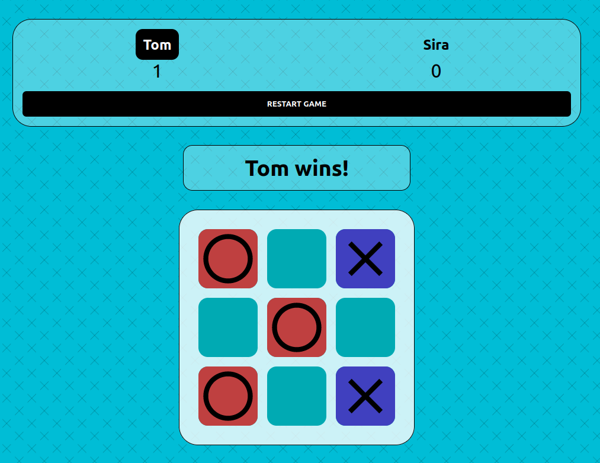

# The Odin Project - Tic Tac Toe

## What is this?

A game of Tic Tac Toe written in HTML, CSS and JavaScript. Based on the "The Odin Project" Foundation curriculum found [here](https://www.theodinproject.com/paths/full-stack-javascript/courses/javascript/lessons/tic-tac-toe).

## Features

- [x] Responsive Layout
- [x] Shows Player One / Player Two Score
- [x] Shows winner after each round
- [ ] Computer opponent

## Image

